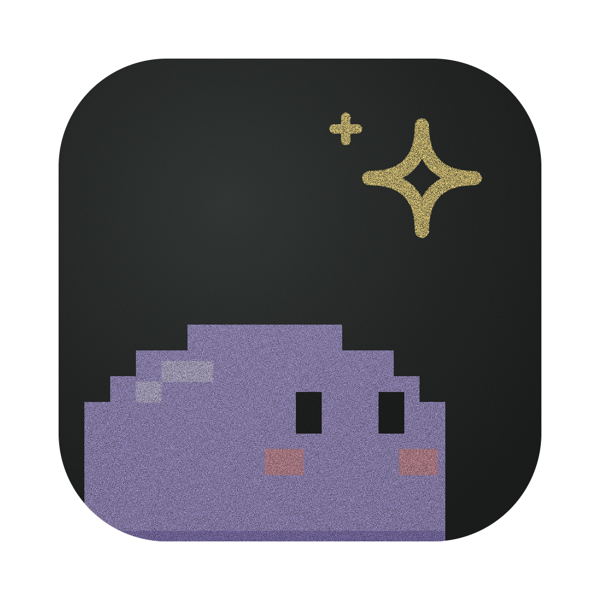
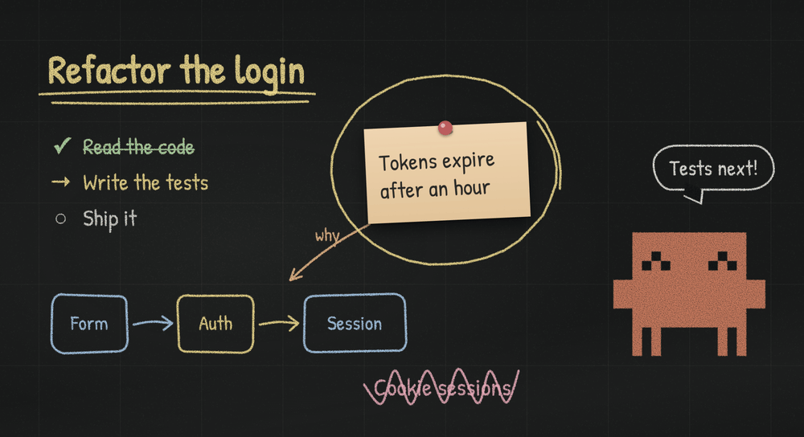

<p align="center"></p>

<h1 align="center">More Space</h1>

<p align="center">A chalkboard and an avatar for any terminal agent.<br>It shows its plan, its progress and its questions while it works.</p>

<p align="center"></p>

## What it is

More Space is a desktop app with a real terminal floating over an endless chalkboard. Run any agent in
that terminal (Claude Code, Codex, or anything else that can run shell commands) and it finds a command
there that lets it:

- **write and draw** on the board: text, checklists, flow diagrams, pinned notes and photos, chalk links
  between them, circles, underlines and scribbles;
- **be someone**: an avatar you choose from a cast of characters, each with its own moods, look and voice;
- **ask you things**: choices, several answers, written answers or a scale, right on the board, and wait
  for your click;
- **steer what you see**: frame what it is explaining, or the whole board.

The command exists only inside the app's terminals and talks only to the window that opened them.
Nothing is installed in your system, and nothing is written into your project.

## Getting started

1. Download the app for your system from [Releases](https://github.com/zohayrslileh/more-space/releases)
   (macOS: `.dmg` for Apple silicon or Intel; Linux: `.AppImage` or `.deb`).
2. Open it and choose a project folder.
3. The empty board shows a short instruction with a **Copy** button. Paste it to your agent in the
   terminal below; it will start by learning the board.

### Unsigned builds

Builds are not signed with an Apple Developer ID yet. The first time on macOS, right-click the app and
choose **Open**, or run:

```sh
xattr -dr com.apple.quarantine "/Applications/More Space.app"
```

## What the agent can do

Everything starts from the command with no arguments; each level explains the next, and
`more-space --all` lists everything at once. `more-space guide` explains the board in one screen.

| Group | Commands |
| --- | --- |
| `board` | `info`, `items`, `write`, `steps`, `flow`, `pin` (image path or URL), `note`, `link`, `mark` (circle, underline, cross), `move`, `erase`, `wash` |
| `avatar` | `info` (who it is and its moods), `move`, `mood`, `say` |
| `ask` | a question with one choice, `--multi`, `--other`, `--text` or `--scale N`; `ask wait <id>` |
| `view` | `fit` (the whole board, kept in view), `show` (frame items or cells), `auto on\|off` |

Several commands can go in one call: `more-space - <<'EOF'` with one command per line.
Every write answers with the cells it really covers, and warns when it lands on something else.

The avatar also follows the terminal by itself: it looks busy while the program keeps printing, shows
"Done" when it goes quiet, and calls you when the program rings the bell or sends a notification.

## Characters, sound and handwriting

- **Characters**: Mochi (the default, a plump pixel spirit), Chalky, Penguin, Owl, Robot, Cat, Cowboy,
  Samurai, Viking, Astronomer and Anime Hero. Each has its own moods (the agent reads them with `avatar info`), drawing and voice.
- **Sound**: chalk on slate as it writes, a bell for questions, each character's own voice on a mood
  change. One button turns it all off.
- **Handwriting**: six chalk-like fonts; Patrick Hand by default.

## Your data

Boards are kept per project folder in the app's own data folder (on macOS,
`~/Library/Application Support/more-space/boards/`), never in the project. Pinned images are copied
there. Nothing leaves your computer, except an image the agent pins from a URL, which the app downloads.

## Platforms

macOS and Linux. Windows is not supported yet: the in-terminal command relies on Unix sockets and
shell scripts.

## Development

Needs [Bun](https://bun.sh).

```sh
bun install
bun start                              # build and open (asks for a project)
bun start -- --cwd=/path/to/project    # open straight on a project
bun run check                          # typecheck, tests, build
bun run package                        # installable app for this system, in release/
bun run icon                           # regenerate icon files from assets/icon/icon.svg
```

The project name is defined once, in `package.json`; the window title, the command, the socket
variable, the data folder and the packaged app's name all derive from it.

| Path | What lives there |
| --- | --- |
| `source/main.ts` | Electron entry: starts the instance and opens the window |
| `source/core/` | The instance: board state, commands and their socket, shells and their activity, characters, settings |
| `source/cli/` | The in-terminal command: a thin client of the instance socket |
| `source/view/desktop/` | Window, preload and IPC |
| `source/view/renderer/` | The page: board stage, chalk items, characters, terminal, sounds |
| `tests/` | Unit tests (`bun test`) |
| `agent/` | The project's working notes: vision, tasks, a dated timeline, lab scripts |

See [CONTRIBUTING.md](CONTRIBUTING.md) for how to work on it, and how releases are made.

## License

[MIT](LICENSE)

More Space is an independent project, not affiliated with or endorsed by Anthropic, OpenAI or any
other maker of the agents it hosts. Product names are used only to say what it works with.
